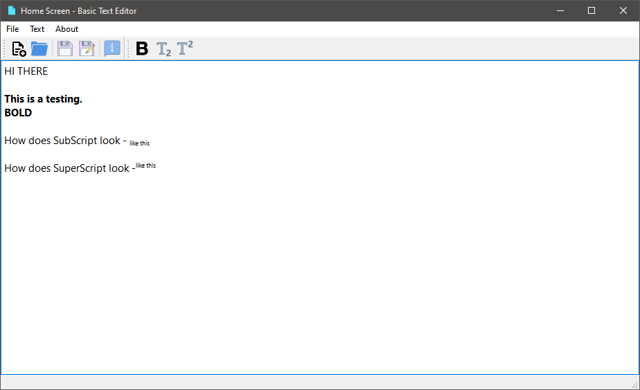
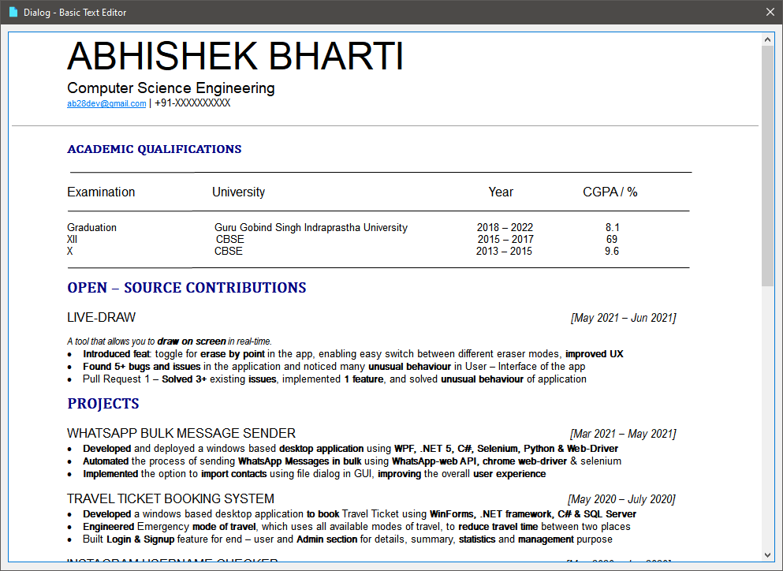

# Basic-Text-Editor
A Basic Text Editor made on QT

## Tools Used
- QTCreator
- MingGW 
- QT
- C++

## Interface

## How to run
- Install QTCreator on your machine
- Open the project
- Click on run

## What has been done
- Built a basic text-editing app
- **BOLD** / UNBOLD of indivial text
- SuperScript and SubScript
- About section - Displays my Resume

## Features
- Open file
- Save & SaveAs
- **BOLD** / UNBOLD
- SuperScript and SubScript
- Resizable Editor

## Todo
- Font, Font Size
- Color
- Allignment & Indent
- Italics, Underline, Strikethrough
- Cut, Copy, Paste
- Zoom In - Out

## Application Screenshot

### Editor

### About

